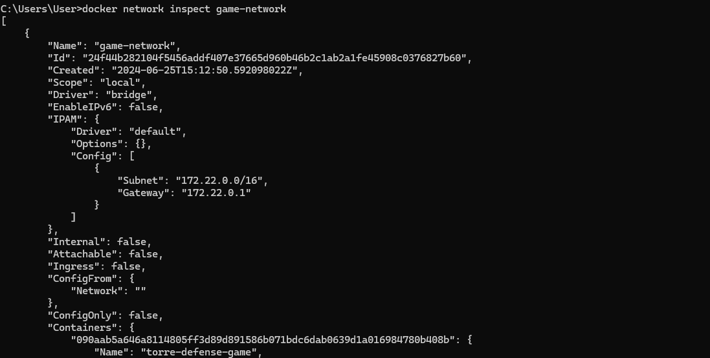

### Descripción del problema V1
### Nombre del problema: Tower Defense Game

#### Configuración de docker

#### Construcción de la imagen Docker

#### Ejecución del contenedor

### Configuración de redes y volúmenes en Docker

#### Crear una red personalizada

#### Crear y montar un Volumen

### Interacción con contenedores usando docker exec

Crea un archivo llamado docker-compose.yml en el directorio donde se encuentra tu proyecto TowerDefenseGame.

### Despliegue en Kubernetes

1. Aplicar el Archivo deployment.yaml
El archivo deployment.yaml define el despliegue de tu aplicación como un conjunto de pods en Kubernetes.

2. Aplicar el Archivo service.yaml
El archivo service.yaml define un Service en Kubernetes para exponer tu aplicación externamente.

### Verificar el estado del despliegue

## Descripción del proyecto: V2

El juego Tower Defense es un videojuego de consola donde el jugador debe defender su base de oleadas
de enemigos colocando torres en lugares estratégicos del mapa. El proyecto incluirá el uso de mocks,
stubs y fakes para pruebas unitarias y de integración utilizando Mockito y pruebas de mutación.

Objetivos de la clase:
1. Configurar y ejecutar contenedores Docker.
2. Configurar redes y volúmenes en Docker.
3. Usardocker exec para interactuar con contenedores en ejecución.
4. Implementar aplicaciones con Docker Compose.
5. Desplegar aplicaciones en Kubernetes.
6. Realizar pruebas unitarias y de integración utilizando Mockito.
7. Implementar pruebas de mutación para verificar la calidad de las pruebas.

### 1. Configurar y ejecutar contenedores Docker.

En este caso para no tener problemas mas adelante con la implemetacion del pitest usare la carpeta org.example para poner mis clases, entonces para modificar el archivo docker se hace lo siguiente:

¿Por qué era necesario este cambio?

- Classpath: Cuando se compilan archivos .java con javac, se generan archivos .class. Estos archivos .class deben estar disponibles en el classpath para que la JVM pueda encontrarlos y ejecutarlos. Si no especificas el classpath correctamente, la JVM no podrá encontrar las clases necesarias y lanzará una excepción ClassNotFoundException.
- Estructura del Proyecto: En mi caso, los archivos .class se generaron en el directorio /app/src/main/java/org/example. Al especificar el classpath como /app/src/main/java, estamos asegurándonos de que la JVM pueda encontrar la estructura de paquetes correcta a partir de ese directorio.

En el primer ejemplo el `Dockerfile` se ubicaba con las clases del programa, sin embargo dado que ahora le damos una ruta especifica, tenemos que ponerlo con la siguiente estructura:

Es decir:

#### Construir  el contenedor

`docker build -t tower-defense-game .`

#### Ejecución del contenedor

`docker run -it --name tower-defense-container tower-defense-game`

### 2. Configurar redes y volúmenes en Docker.

### 2.1 REDES
Docker proporciona la capacidad de crear redes aisladas para que los contenedores se comuniquen entre sí de manera segura y eficiente. La creación de una red personalizada se puede hacer con:
`docker network create game-network`

Ejecutar el contenedor en la red

`docker run -it --name torre-defense-game --network game-network tower-defense-game`

Y los contenedores pueden unirse a esta red mediante la opción--network al ejecutardocker run.

Por ejemplo (se puede usar `docker network connect game-network tower-defense-game` si ya se tiene los contenedores):

 Ejecutar el primer contenedor, conectándolo a game-network

`docker run -it --name torre-defense-game --network game-network tower-defense-game`

 Ejecutar el segundo contenedor, también conectándolo a game-network

`docker run --network game-network --name tower-defense-container tower-defense-game`

con el comando `docker ps -a` listamos los contenedores y vemos que estan en estado "UP" 

Tambien se puede ver todo esto en el docker Desktop:

Finalmente, puedes verificar que los contenedores están correctamente conectados a la red game-network usando el comando `docker network inspect game-network`

### 2.1 Volúmenes en Docker

Los volúmenes se utilizan para persistir datos generados y utilizados por los contenedores Docker. Los
volúmenes son gestionados por Docker y pueden ser compartidos entre contenedores. Crear un
volumen se hace con:
`docker volume create game-data`

Ejecutar el nuevo contenedor con el volumen:

`docker run -it --name tower-defense-containervolumen --network game-network -v game-data:/app/data tower-defense-game`

### 3. Usardocker exec para interactuar con contenedores en ejecución.
El comandodocker exec permite ejecutar comandos dentro de un contenedor Docker en ejecución. Esto
es útil para depuración, administración y mantenimiento. Por ejemplo:
`docker exec -it tower-defense-container /bin/bash`

Abre una sesión interactiva en el contenedor:

Para el ejemplo creare el directorio /app/data  dentro del contenedor y aqui creare un archivo Test para probar usando el siguiente comando dentro de una sesión interactiva en el contenedor:

`docker exec -it tower-defense-container mkdir -p /app/data`

Veo que se añadio en Files del Docker Desktop

Dentro de la sesión interactiva, navegamos al directorio /app/data y creamos un archivo:

Para listar  los archivos en el directorio /app/data sin abrir una sesión interactiva podemos usar :

Y para ver el contenido se puede usar `docker exec tower-defense-container cat /app/data/testfile.txt`

### 4. Implementar aplicaciones con Docker Compose.

Docker Compose es una herramienta para definir y ejecutar aplicaciones Docker multi-contenedor. Con
un archivo YAML, se pueden configurar los servicios, redes y volúmenes necesarios para la aplicación.
Por ejemplo, un archivodocker-compose.yml para nuestro juego (puesto a nivel de Dockerfile):

En mi caso:

Para iniciar los servicios definidos, se usa el comando:
`docker-compose up -d`

Me dice que la version de yml es obsoleta por lo que la solucion es eliminar la primera linea, ejecutamos de nuevo y verificamos si los contenedores están en ejecución utilizando:

`docker-compose ps`

### 5. Desplegar aplicaciones en Kubernetes.

### 5.1 Kubernetes

Kubernetes es una plataforma de orquestación de         contenedores de código abierto diseñada para automatizar la implementación, escalado y operación de aplicaciones en contenedores. Kubernetes
permite gestionar clústeres de máquinas virtuales o físicas de manera eficiente. Los componentes
principales incluyen:

- Pods

     Un Pod es la unidad de despliegue más pequeña en Kubernetes, que puede contener uno o varios
    contenedores que comparten almacenamiento y red.

- Deployment

    Un Deployment asegura que una cantidad especificada de réplicas de una aplicación estén corriendo en
        cualquier momento. 

Ejemplo deployment.yaml:

Aplicar los archivos de configuración en Kubernetes
`kubectl apply -f deployment.yaml`

Podemos listar todos los despliegues en tu clúster Kubernetes con el siguient comando: `kubectl get deployments`

Para ver los Pods creados por el Deployment:
`kubectl get pods`

### 5.2 Service

Un Service en Kubernetes expone una aplicación corriendo en uno o más Pods como un servicio de red.

Ejemplo deservice.yaml:

Aplicar los archivos de configuración en Kubernetes:
`kubectl apply -f service.yaml`

Puedes verificar que el servicio se haya creado correctamente con los siguientes comandos:
`kubectl get services`

Crear un servicio en Kubernetes te permite exponer tu aplicación a la red, ya sea dentro del clúster o externamente, dependiendo del tipo de servicio. Usar un LoadBalancer es útil para proporcionar acceso externo a tu aplicación, especialmente en entornos de nube.

### 6. Realizar pruebas unitarias y de integración utilizando Mockito.

### 7. Implementar pruebas de mutación para verificar la calidad de las pruebas.
