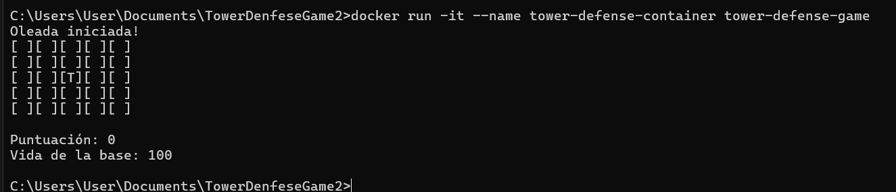
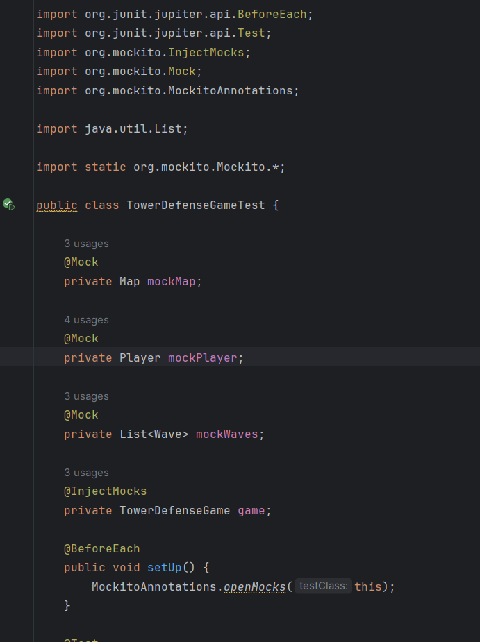
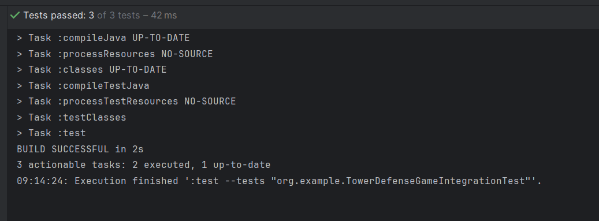
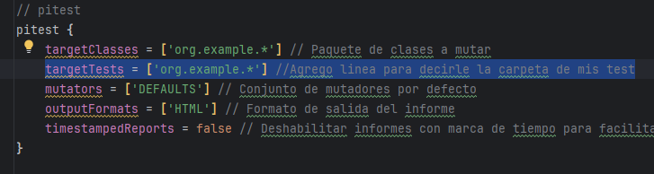
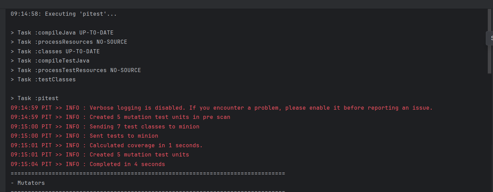
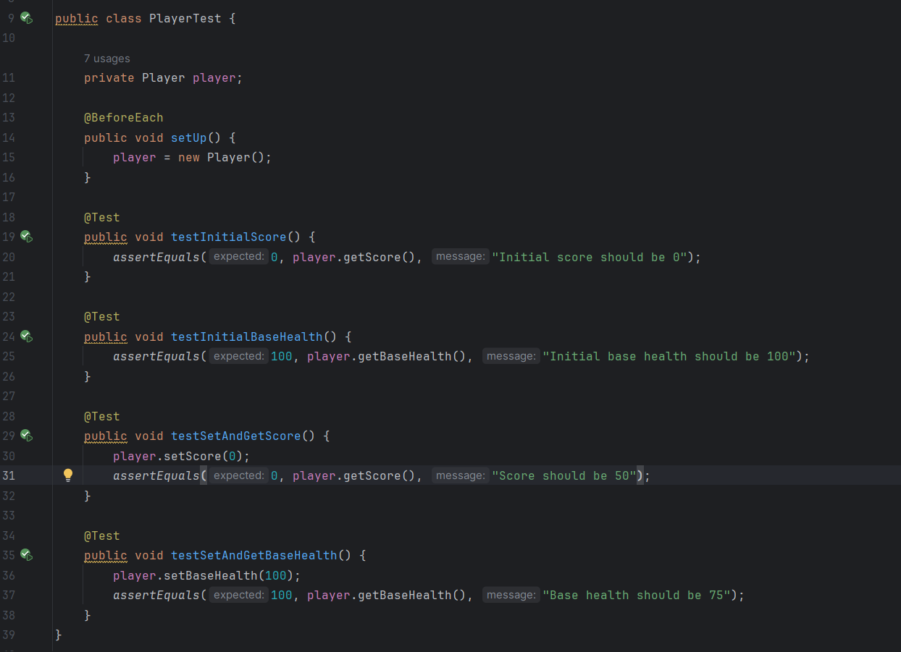
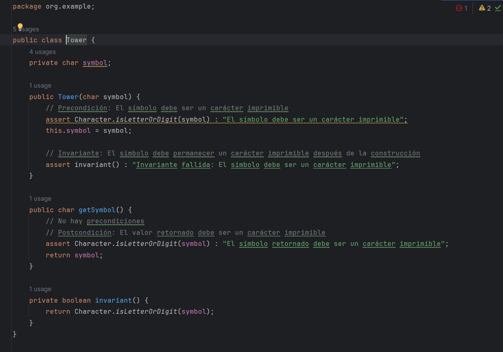
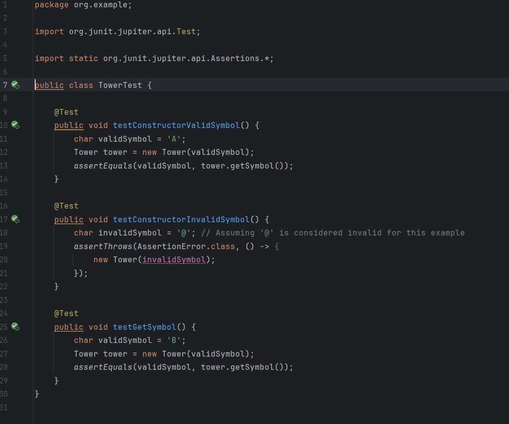

## Descripción del proyecto: V2

El juego Tower Defense es un videojuego de consola donde el jugador debe defender su base de oleadas
de enemigos colocando torres en lugares estratégicos del mapa. El proyecto incluirá el uso de mocks,
stubs y fakes para pruebas unitarias y de integración utilizando Mockito y pruebas de mutación.

Objetivos de la clase:
1. Configurar y ejecutar contenedores Docker.
2. Configurar redes y volúmenes en Docker.
3. Usardocker exec para interactuar con contenedores en ejecución.
4. Implementar aplicaciones con Docker Compose.
5. Desplegar aplicaciones en Kubernetes.
6. Realizar pruebas unitarias y de integración utilizando Mockito.
7. Implementar pruebas de mutación para verificar la calidad de las pruebas.

# PARTE TEORICA

### Configuración y uso de docker (3 puntos)
- Describe los principios fundamentales de los contenedores Docker y su arquitectura interna.
Explica cómo Docker maneja la seguridad y el aislamiento de contenedores.

    - Aislamiento: Docker usa contenedores para aislar aplicaciones y sus dependencias del sistema operativo host y de otros contenedores.
    - Portabilidad: Los contenedores Docker pueden ejecutarse en cualquier sistema que tenga Docker instalado, independientemente del entorno subyacente.
    - Ligereza: A diferencia de las máquinas virtuales, los contenedores comparten el kernel del sistema operativo host, lo que reduce significativamente el uso de recursos.

    Arquitectura Interna:

    - Docker Engine: El núcleo de Docker, que incluye:
    Docker Daemon: Se ejecuta en el host y gestiona los contenedores.
    - REST API: Interface para interactuar con el daemon de Docker.
    - CLI (Interfaz de Línea de Comandos): Herramienta de usuario para comunicarse con Docker.
    - Imagenes y contenedores.

- Compara y contrasta Docker con soluciones de virtualización tradicionales, como VMware y
VirtualBox. Discute las ventajas y desventajas de cada enfoque.

    - Ventajas:
        Mayor eficiencia en el uso de recursos.
        Arranque más rápido de contenedores.
        Facilidad de despliegue y portabilidad.
    - Desventajas:
        Aislamiento de seguridad más débil en comparación con las VMs.
        Dependencia del kernel del host.

### Redes y volúmenes en Docker (3 puntos)

- Explica en detalle cómo Docker maneja las redes y los volúmenes. Discute los diferentes
tipos de redes (bridge, host, overlay) y cuándo es apropiado usar cada una.

    - Bridge: Red predeterminada que Docker crea en un host es ideal para comunicaciones internas entre contenedores en el mismo host.
    - Host: El contenedor comparte la pila de red del host mayormente se ussa para aplicaciones que necesitan rendimiento de red maximo.
    - Overlay: Permite la comunicación entre contenedores en diferentes host.

- Describe los mecanismos de persistencia de datos en Docker, incluyendo volúmenes y bind
mounts. Explica las diferencias entre ellos y las mejores prácticas para su uso.

    Las mejores prácticas incluyen su uso para compartir datos entre contenedores y para la persistencia de datos.

    Bind Mounts: Monta un directorio o archivo específico del host en el contenedor, es más flexible, pero depende del sistema de archivos del host.

### Orquestación con Kubernetes (4 puntos)

- Describe la arquitectura de Kubernetes y sus componentes principales, incluyendo el API
server, etcd, scheduler, y kubelet. Explica cómo estos componentes interactúan para
gestionar un clúster de Kubernetes.

    - API Server: Punto de entrada para todas las interacciones con el clúster.
    etcd: Almacén de datos distribuido y consistente para toda la información del clúster.
    - Scheduler: Asigna pods a los nodos basándose en restricciones y disponibilidad de recursos.
    - Kubelet: Agente que se ejecuta en cada nodo, asegurando que los contenedores estén ejecutándose correctamente.

- Discute las estrategias de escalabilidad y alta disponibilidad en Kubernetes. Explica cómo
Kubernetes maneja la recuperación de fallos y la gestión de réplicas.

    - Escalabilidad:

        - Horizontal: Añadir más nodos al clúster.
        - Vertical: Aumentar los recursos (CPU, RAM) de los nodos existentes.
    - Alta Disponibilidad:

        - Replicación de Pods: Ejecutar múltiples réplicas de pods para asegurar disponibilidad continua.
        - Auto-healing: Kubernetes reinicia automáticamente los pods fallidos.

### Pruebas unitarias y de integración con Mockito (4 puntos)

- Explica los conceptos de mocks, stubs y fakes. Discute cuándo y cómo se deben utilizar estos
patrones en las pruebas unitarias.

    - Mocks: Objetos simulados que verifican interacciones específicas durante las pruebas.
    - Stubs: Objetos con comportamientos predefinidos que retornan datos específicos cuando se les llama
    - Fakes: Implementaciones simples de interfaces o clases que funcionan de manera similar a la versión real pero con funcionalidad reducida.

### Pruebas de mutación (4 puntos)

- Define qué son las pruebas de mutación y cómo contribuyen a la mejora de la calidad del
software. Explica los tipos de operadores de mutación y su propósito.

Las pruebas de mutación son una técnica de prueba de software que se utiliza para evaluar la calidad y efectividad de los casos de prueba existentes. Consiste en introducir pequeñas modificaciones (mutaciones) deliberadas en el código del programa para crear versiones ligeramente alteradas del mismo, conocidas como "mutantes". Luego, se ejecutan los casos de prueba existentes contra estos mutantes para verificar si los casos de prueba pueden detectar y fallar ante estos cambios

- Discute las métricas utilizadas para evaluar la efectividad de las pruebas de mutación, como
la tasa de mutación (mutation score) y la cobertura de mutación.

    - Tasa de Mutación (Mutation Score):Es el porcentaje de mutantes que fueron detectados y eliminados por el conjunto de pruebas.

    - Cobertura de Mutación: Mide qué tan bien las pruebas cubren el código modificado por los mutantes.

### Diseño por contrato (Design by Contract) (2 puntos)

- Explica el concepto de diseño por contrato y cómo se aplica en el desarrollo de software.

    La idea central es que los componentes del software (clases, métodos, módulos, etc.) interactúan entre sí a través de contratos formales que especifican las obligaciones y beneficios para cada parte.

- Discute las diferencias entre precondiciones, postcondiciones e invariantes.
 Describe cómo el diseño por contrato puede mejorar la robustez y mantenibilidad del código.

    - Precondiciones: Son las condiciones que deben ser verdaderas antes de que un método o función pueda ser ejecutado. Es la responsabilidad del cliente (el código que llama al método) asegurarse de que las precondiciones se cumplan.

    - Postcondiciones: Son las condiciones que deben ser verdaderas después de que un método o función ha sido ejecutado. Es la responsabilidad del proveedor (el método o función) asegurarse de que las postcondiciones se cumplan al finalizar la ejecución.

    - Invariantes: Son condiciones que deben ser verdaderas en todo momento durante la vida de un objeto. Estas condiciones definen un estado consistente para el objeto y deben mantenerse antes y después de cualquier operación pública sobre el objeto.

# PARTE PRACTICA
### 1. Configurar y ejecutar contenedores Docker.

En este caso para no tener problemas mas adelante con la implemetacion del pitest usare la carpeta org.example para poner mis clases, entonces para modificar el archivo docker se hace lo siguiente:

¿Por qué era necesario este cambio?

- Classpath: Cuando se compilan archivos .java con javac, se generan archivos .class. Estos archivos .class deben estar disponibles en el classpath para que la JVM pueda encontrarlos y ejecutarlos. Si no especificas el classpath correctamente, la JVM no podrá encontrar las clases necesarias y lanzará una excepción ClassNotFoundException.
- Estructura del Proyecto: En mi caso, los archivos .class se generaron en el directorio /app/src/main/java/org/example. Al especificar el classpath como /app/src/main/java, estamos asegurándonos de que la JVM pueda encontrar la estructura de paquetes correcta a partir de ese directorio.

En el primer ejemplo el `Dockerfile` se ubicaba con las clases del programa, sin embargo dado que ahora le damos una ruta especifica, tenemos que ponerlo con la siguiente estructura:

Es decir:

#### Construir  el contenedor

`docker build -t tower-defense-game .`

#### Ejecución del contenedor

`docker run -it --name tower-defense-container tower-defense-game`

### 2. Configurar redes y volúmenes en Docker.

### 2.1 REDES
Docker proporciona la capacidad de crear redes aisladas para que los contenedores se comuniquen entre sí de manera segura y eficiente. La creación de una red personalizada se puede hacer con:
`docker network create game-network`

Ejecutar el contenedor en la red

`docker run -it --name torre-defense-game --network game-network tower-defense-game`

Y los contenedores pueden unirse a esta red mediante la opción--network al ejecutardocker run.

Por ejemplo (se puede usar `docker network connect game-network tower-defense-game` si ya se tiene los contenedores):

 Ejecutar el primer contenedor, conectándolo a game-network

`docker run -it --name torre-defense-game --network game-network tower-defense-game`

 Ejecutar el segundo contenedor, también conectándolo a game-network

`docker run --network game-network --name tower-defense-container tower-defense-game`

con el comando `docker ps -a` listamos los contenedores y vemos que estan en estado "UP" 

Tambien se puede ver todo esto en el docker Desktop:

Finalmente, puedes verificar que los contenedores están correctamente conectados a la red game-network usando el comando `docker network inspect game-network`

### 2.1 Volúmenes en Docker

Los volúmenes se utilizan para persistir datos generados y utilizados por los contenedores Docker. Los
volúmenes son gestionados por Docker y pueden ser compartidos entre contenedores. Crear un
volumen se hace con:
`docker volume create game-data`

Ejecutar el nuevo contenedor con el volumen:

`docker run -it --name tower-defense-containervolumen --network game-network -v game-data:/app/data tower-defense-game`

### 3. Usardocker exec para interactuar con contenedores en ejecución.
El comandodocker exec permite ejecutar comandos dentro de un contenedor Docker en ejecución. Esto
es útil para depuración, administración y mantenimiento. Por ejemplo:
`docker exec -it tower-defense-container /bin/bash`

Abre una sesión interactiva en el contenedor:

Para el ejemplo creare el directorio /app/data  dentro del contenedor y aqui creare un archivo Test para probar usando el siguiente comando dentro de una sesión interactiva en el contenedor:

`docker exec -it tower-defense-container mkdir -p /app/data`

Veo que se añadio en Files del Docker Desktop

Dentro de la sesión interactiva, navegamos al directorio /app/data y creamos un archivo:

Para listar  los archivos en el directorio /app/data sin abrir una sesión interactiva podemos usar :

Y para ver el contenido se puede usar `docker exec tower-defense-container cat /app/data/testfile.txt`

### 4. Implementar aplicaciones con Docker Compose.

Docker Compose es una herramienta para definir y ejecutar aplicaciones Docker multi-contenedor. Con
un archivo YAML, se pueden configurar los servicios, redes y volúmenes necesarios para la aplicación.
Por ejemplo, un archivodocker-compose.yml para nuestro juego (puesto a nivel de Dockerfile):

En mi caso:

Para iniciar los servicios definidos, se usa el comando:
`docker-compose up -d`

Me dice que la version de yml es obsoleta por lo que la solucion es eliminar la primera linea, ejecutamos de nuevo y verificamos si los contenedores están en ejecución utilizando:

`docker-compose ps`

### 5. Desplegar aplicaciones en Kubernetes.

### 5.1 Kubernetes

Kubernetes es una plataforma de orquestación de         contenedores de código abierto diseñada para automatizar la implementación, escalado y operación de aplicaciones en contenedores. Kubernetes
permite gestionar clústeres de máquinas virtuales o físicas de manera eficiente. Los componentes
principales incluyen:

- Pods

     Un Pod es la unidad de despliegue más pequeña en Kubernetes, que puede contener uno o varios
    contenedores que comparten almacenamiento y red.

- Deployment

    Un Deployment asegura que una cantidad especificada de réplicas de una aplicación estén corriendo en
        cualquier momento. 

Ejemplo deployment.yaml:

Aplicar los archivos de configuración en Kubernetes
`kubectl apply -f deployment.yaml`

Podemos listar todos los despliegues en tu clúster Kubernetes con el siguient comando: `kubectl get deployments`

Para ver los Pods creados por el Deployment:
`kubectl get pods`

### 5.2 Service

Un Service en Kubernetes expone una aplicación corriendo en uno o más Pods como un servicio de red.

Ejemplo deservice.yaml:

Aplicar los archivos de configuración en Kubernetes:
`kubectl apply -f service.yaml`

Puedes verificar que el servicio se haya creado correctamente con los siguientes comandos:
`kubectl get services`

Crear un servicio en Kubernetes nos permite exponer tu aplicación a la red, ya sea dentro del clúster o externamente, dependiendo del tipo de servicio. Usar un LoadBalancer es útil para proporcionar acceso externo a nuestra aplicación, especialmente en entornos de nube.

### 6. Realizar pruebas unitarias y de integración utilizando Mockito.

####  Escribe pruebas unitarias para la clase TowerDefenseGame utilizando Mockito para simular
las dependencias de Map, Player y Wave.

Pruebas Unitarias para TowerDefenseGame
- testPlaceTower:

    Verifica que el método placeTower de TowerDefenseGame llama al método placeTower de la clase Map con los parámetros correctos.

    Se crea un mock de la clase Tower, se llama al método placeTower del juego con este mock y coordenadas (2, 2), y se verifica que el mock de Map recibió la llamada al método placeTower con los mismos parámetros.

- testStartWave:

    Verifica que el método startWave de TowerDefenseGame añade una nueva instancia de Wave a la lista de olas (waves) y llama al método start en esta instancia.
    
    Se llama al método startWave del juego, se verifica que una instancia de Wave fue añadida a la lista de olas y que el método start fue llamado en esa instancia.
- testGameState:

    Verifica que el método gameState de TowerDefenseGame llama a los métodos toString de Map, getScore y getBaseHealth de Player, y muestra el estado del juego correctamente.

    Se configuran los mocks de Player para que devuelvan valores específicos para la puntuación y la salud de la base, y se llama al método gameState del juego. Luego, se verifica que los métodos correctos fueron llamados en los mocks y que los valores se imprimen adecuadamente.

    

####  Implementa pruebas de integración que verifiquen la interacción entre las clases principales(TowerDefenseGame, Map, Player, Wave). Utiliza Mockito para controlar y verificar el comportamiento de las dependencias en estas pruebas.

- testPlaceTowerIntegration:

    Verifica que el método placeTower coloca una torre en el mapa en las coordenadas especificadas.

    Se crea una instancia real de Tower y se llama al método placeTower del juego con esta instancia y coordenadas (2, 2). Luego, se verifica que el símbolo de la torre está presente en la posición correcta del mapa.
- testStartWaveIntegration:

    Verifica que el método startWave añade una nueva instancia de Wave a la lista de olas y la inicia.

    Se llama al método startWave del juego y se verifica que la lista de olas no está vacía y contiene exactamente una instancia de Wave.
- testGameStateIntegration:

    Verifica que el método gameState muestra correctamente el estado del juego, incluyendo el mapa, la puntuación del jugador y la salud de la base.

    Se colocan torres en el mapa y se inician olas en el juego. Luego, se llama al método gameState y se verifica que la puntuación del jugador, la salud de la base y el estado del mapa se imprimen correctamente.

    

### 7. Implementar pruebas de mutación para verificar la calidad de las pruebas.

Configuracion:

Entonces ahora ejecuto con el comando `./gradlew pitest` y abrimos el reporte:

Aunque mis pruebas tienen un buen nivel de fuerza (60%, es decir que todas las pruebas pasan correctamente), la cobertura de mutación del 18% sugiere que podría haber áreas en las cuales las mutaciones introducidas no están siendo suficientemente probadas. Esto es cierto pues se ha escrito pruebas solo para algunas clases, sin embargo podemos aunmentar la cobertura revisando las mutaciones que no fueron detectadas y ajustar las pruebas para capturar estos casos.

Aca se puede apreciar los test para las clases que hemos cubierto y las que no:

Para ejemplificar como se aumenta creare un test para la clase player:

- testInitialScore:

    Verifica que la puntuación inicial del Player sea 0.

- testInitialBaseHealth:

    Verifica que la salud inicial de la base del Player sea 100.

- testSetAndGetScore:
    Prueba que el método setScore (si se implementa) establece la puntuación correctamente y que el método getScore devuelve la puntuación esperada.

- testSetAndGetBaseHealth:

    Prueba que el método setBaseHealth (si se implementa) establece la salud de la base correctamente y que el método getBaseHealth devuelve la salud esperada.

Aumento a 24%, dado que el objetivo no es hacer pruebas unitarias para cada clase si no mas bien mostrar ejemplos de mocks,stubs y fakes, podemos decir que nuestra cobertura de mutaciones es la correcta.

### 8. Diseño por contrato

#### Aplica el diseño por contrato a la clase Tower. Define las precondiciones, postcondiciones e invariantes de los métodos principales de la clase.

La clase Tower ahora está diseñada utilizando el enfoque de Diseño por Contrato para asegurar que se cumplan ciertas condiciones antes y después de la ejecución de sus métodos y que se mantengan invariantes durante su ciclo de vida.

Explicacion:

- Precondiciones: Condiciones que deben ser verdaderas antes de la ejecución de un método o constructor. En este caso, el símbolo debe ser un carácter imprimible antes de que se cree una instancia de Tower.
- Postcondiciones: Condiciones que deben ser verdaderas después de la ejecución de un método. Aquí, el símbolo retornado por getSymbol() debe ser un carácter imprimible.
- Invariantes: Condiciones que deben ser verdaderas durante toda la vida de la instancia de la clase. En la clase Tower, el símbolo debe ser siempre un carácter imprimible.

#### Escribe pruebas unitarias que verifiquen el cumplimiento de los contratos definidos para la clase Tower. Utiliza herramientas como Java Assertions para implementar estas verificaciones.

- testConstructorValidSymbol:

    - Verifica que el constructor funciona correctamente cuando se le proporciona un símbolo válido.
    - Precondición: El símbolo debe ser un carácter imprimible.
    - Postcondición: El símbolo almacenado en la torre debe ser el mismo que el proporcionado.
- testConstructorInvalidSymbol:

    - Verifica que el constructor arroja una AssertionError cuando se le proporciona un símbolo no imprimible.
    - Precondición: El símbolo no debe ser un carácter imprimible.
- testGetSymbol:

    - Verifica que el método getSymbol retorna el símbolo correcto.
    - Postcondición: El símbolo retornado debe ser el mismo que el proporcionado al constructor.

    

